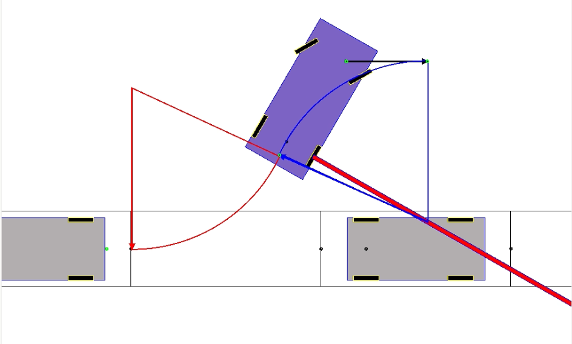

# Highway: A light and open-source simulator for autonomous driving research.

*Note: this repo is given 'as it' since I'm currently have no time to work on it. There are lot of things to do before
having a complete simulator.

## Why another vehicle simulator ?

[](https://www.youtube.com/shorts/ZNt48pTXtO0)

*Fig 1 - A parallel automatic maneuver. Click on the image to run the video.*

This simulator has not the pretention to revolutionize the world of the vehicle simulation but is just a personal challenge for offering an intuitive API for autonomous driving research.

When I tried [Carla simulator](https://github.com/carla-simulator/carla), I did not like the following points:
- Hard to install (Unreal Engine, NVidia drivers, patches, need Docker ...) and takes giga bytes of binaries on the hard disk. The application is low to run.
- Very instable: lot of crashes, lot of issues on GitHub that are never fixed and a robot is auto-closing them after X days without answers.
- The physical models of cars are not very realist: looks like playing the GTA III game.
- The most important is the API is not developper friendly and poorly documented. For example, When reading the first lines of the API: `carla.Actor: defines actors as anything that plays a role in the simulation or can be moved around. That includes: pedestrians, vehicles, sensors and traffic signs ...` but when reading their Actor methods: `close_door()` ... We can interrogate if this API has been really tough.
- The documentation is sometimes hard to understand. I was personnaly stuck searching on the API what methods giving me dimensions of my car (wheel base ...), or how to understand how they have implemented Akermann ...

In my opinion, a simulator has to help the developper by offering the possibility to interact with all objects in the word. For example the simulator has to reply to question such as "give me the list of pedestrians around the car" ... a reference list that can be compared at run time with the list of pedestrians detected by your IA/sensors/ECU of your ego vehicle. This idea can be extended to any mobile/static object in the city: pedestrian, cars, roads, traffic signs, zebras, parking slot, spawning points ... all of them shall interact with the ego vehicle and share their states (ie traffic light: the color of the light, the content of any road signs ie "Nationale 20" ...).

Ideally, the API shall distinguish helper methods to twick the simulation from real physical behavior by explicit methods for example apply a constant velocity along its longitudinal side.

Here a list of things a simulator can help and that I did not find in Carla:
- Triggering collisions events;
- Offering to the developper different physical models (kinematics, dynamics ...) that can be changed at run time or offering to the player the way to develop it's own model. Same idea for the cruse controller.
- Accessing to blueprint/dimension of the car (wheelbase ...), parking, roads, objects around;
- Helping the developper cheating: for example, applying a constant longitudinal velocity to the car if we do not want to simulate the brake and the accelerator pedals;
- Monitoring vehicle states and save logs that be replayed or plot graphics (for example in Matlab or Julia);
- Displaying shapes to inform the developper: for example the arc for turning circle, show spawning points identifier, show arrows for the vehicle speed, acceleration, the car path ...

## Compilation / Installation

### Compilation

This code depends on:
- C++-17 compiler (g++, clang++)
- lib [SFML]( https://www.sfml-dev.org/) for 2D graphism.
- SWI Prolog: `sudo apt-get install swi-prolog`.
- [Backward-cpp](https://github.com/bombela/backward-cpp) for stack tracing on segfaults.
  This is downloaded (but not installed on your operating system) when compiling in debug
  mode.
- Google tests for unit tests.

To compile and install the standalone application:

```sh
git clone git@github.com:Lecrapouille/Highway.git --depth=1
make clean
make -j8
```

Scenario files are automatically compiled. But here what is made:

```sh
for i in `ls Scenarios` do
  (cd $i
   make clean
   make -j8)
end
cp Scenarios/*/build/*.so data/Scenarios/
```

The compiled simulation files are in `Scenarios/xxx/build/xxx.so` but then are copied
into the [data/Scenarios](data/Scenarios/) folder. There a pure shared library that
can be opened by the standalone application with (`dlopen`). See next section for more information.


To run the standalone application.
```sh
./build/Highway
```

To run the standalone application and running a given scenario (shared library).
This will skip some IHM menu and jump directly into the simulation.

```sh
Highway scenario.so
```

To install the application and scenarios on your operating system:

```sh
sudo make install
```

To run the standalone application installed on your system:

```sh
Highway
```

## Documentation

- The index of detail design documents: [doc/README.md](doc/README.md).

-  The code source refers to mathematic formulas from the documents
cited in the bibliography section. For emacs users, when diving inside
the code source, you can type `M-x turn-on-iimage-mode` to show pictures
inside C++ comments. This will help you to understand the code bind
to mathematic formulas of these documents.

- To generate Doxygen documentation.

```sh
make doc
```

The generated documentation can be find in `doc/html`.

## Developpers

### Non regression tests

To make unit tests and generate code coverage.

```sh
make check -j8
```

Or

```sh
cd tests
make coverage -j8
```

If you do not want generating reports.

```sh
cd tests
make -j8
./build/Highway-Tests
```

### Compress your work

To create a tar.gz of the project with management of name conflict concerning the tarball name. Compiled files, generated doc, git files and backup files are not stored in the tarball.

```sh
make tarball
```
