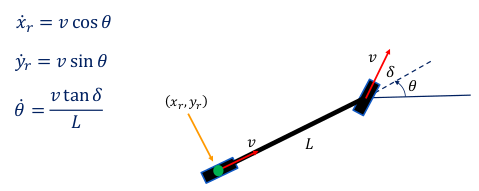
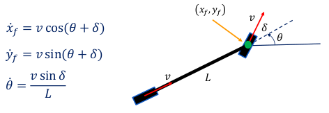
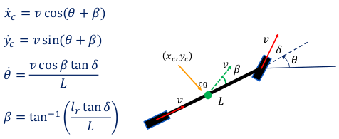

# Kinematic Bicycle Models

In the proposed bicycle model, the front wheel represents the front right and left wheels of the car, and the rear wheel represents the rear right and left wheels of the car.

To analyze the kinematics of the bicycle model, we must select a reference point (x, y) on the vehicle which can be placed at the center of the rear axle, the center of the front axle, or at the center of gravity (CG).

- `L` for the wheelbase: the length of the bicycle, measured between the two wheel axes.
- `v` is the velocity of the vehicle (input) and points in the same direction as each wheel.
- `Delta` is the steering angle (input).
- `Theta` is the heading of the bicycle.
- `Beta` is the slip angle or sideslip angle, and is measured as the angular difference between the velocity `v` at the CG and the heading of the bicycle.

## Rear Axle Kinematic Bicycle Model

## Front Axle Kinematic Bicycle Model

## CG Kinematic Bicycle Model

## Comparison between kinematic models

| **Criterion**               | **Rear axle model**         | **Front axle model**         | **CG model**                 |
|-----------------------------|-----------------------------|------------------------------|------------------------------|
| **Complexity**              | Simple                      | Simple                       | More complex                 |
| **Low-speed accuracy**      | Good (especially in reverse)| Good                         | Very good                    |
| **High-speed accuracy**     | Less good                   | Moderate                     | Good                         |
| **Sharp turn dynamics**     | Less realistic              | More realistic               | Very realistic               |
| **Applications**            | Low-speed maneuvers or reversing | Forward driving at low/medium speeds | General modeling and stability analysis |
