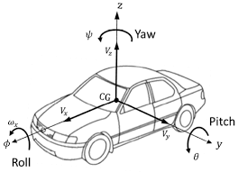
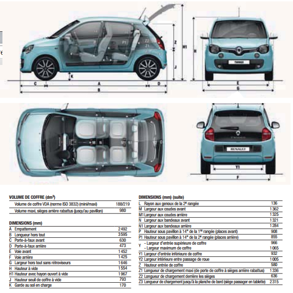

# Vehicle

The vehicle class has been split into several parts blueprint and shapes:
- The blueprint holds dimensions, orientation and orientation of elements. It is used for computations.
- The shape has two roles: to display of the object on the simulation GUI but also for collision detections (i.e. vehicle shape).

Elements of the vehicle are set inside an hierarchy. The initial element is the shape of the vehicle. The direction of the elements follow coordinates of the vehicle frame (Xx, Yv, Zv), following the ISO 8855, where Xv: points towards the vehicle, Yv: points to the left of the vehicle, Zv: points to the top of the vehicle. The origin of the frame is fixed to the middle of the rear wheel axle.




- physic
- controler
-

## Blueprints

Dimensions of vehicles are stored in a database named `blueprints`. For example the following figure:



The following json [file](../../../../../data/blueprints.json) feeds the database.

##

## Vehicle Shape hierarchy

A scene graph is used for the hierarchy of objects, in which children are transformed relative to
their parent. For more information you can read this document [Scene Graphs](https://research.ncl.ac.uk/game/mastersdegree/graphicsforgames).

The following scene graph representing a vehicle (result may change)

```
└─ "vehicle"
    ├ Origin: (0, 0)
    ├ Position: (100, 50)
    ├ Rotation: 0 deg
    └ Children: 4
    ├─ "wheels"
    │   ├ Origin: (0, 0)
    │   ├ Position: (0, 0)
    │   ├ Rotation: 0 deg
    │   └ Children: 4
    │   ├─ "FR"
    │   │   ├ Origin: (0.328, 0.05)
    │   │   ├ Position: (2.46, -0.79)
    │   │   ├ Rotation: 0 deg
    │   │   └ Children: 0
    │   ├─ "FL"
    │   │   ├ Origin: (0.328, 0.05)
    │   │   ├ Position: (2.46, 0.79)
    │   │   ├ Rotation: 0 deg
    │   │   └ Children: 0
    │   ├─ "RL"
    │   │   ├ Origin: (0.328, 0.05)
    │   │   ├ Position: (0, 0.79)
    │   │   ├ Rotation: 0 deg
    │   │   └ Children: 0
    │   └─ "RR"
    │       ├ Origin: (0.328, 0.05)
    │       ├ Position: (0, -0.79)
    │       ├ Rotation: 0 deg
    │       └ Children: 0
    ├─ "turning indicators"
    │   ├ Origin: (0, 0)
    │   ├ Position: (0, 0)
    │   ├ Rotation: 0 deg
    │   └ Children: 4
    │   ├─ "FR"
    │   │   ├ Origin: (0, 0)
    │   │   ├ Position: (3.04, -0.79)
    │   │   ├ Rotation: 0 deg
    │   │   └ Children: 0
    │   ├─ "FL"
    │   │   ├ Origin: (0, 0)
    │   │   ├ Position: (3.04, 0.79)
    │   │   ├ Rotation: 0 deg
    │   │   └ Children: 0
    │   ├─ "RL"
    │   │   ├ Origin: (0, 0)
    │   │   ├ Position: (-0.58, 0.79)
    │   │   ├ Rotation: 0 deg
    │   │   └ Children: 0
    │   └─ "RR"
    │       ├ Origin: (0, 0)
    │       ├ Position: (-0.58, -0.79)
    │       ├ Rotation: 0 deg
    │       └ Children: 0
    ├─ lights
    │   ├ Origin: (0, 0)
    │   ├ Position: (0, 0)
    │   ├ Rotation: 0 deg
    │   └ Children: 4
    │   ├─ FR
    │   │   ├ Origin: (0, 0)
    │   │   ├ Position: (3.04, -0.69)
    │   │   ├ Rotation: 0 deg
    │   │   └ Children: 0
    │   ├─ FL
    │   │   ├ Origin: (0, 0)
    │   │   ├ Position: (3.04, 0.69)
    │   │   ├ Rotation: 0 deg
    │   │   └ Children: 0
    │   ├─ RL
    │   │   ├ Origin: (0, 0)
    │   │   ├ Position: (-0.58, 0.69)
    │   │   ├ Rotation: 0 deg
    │   │   └ Children: 0
    │   └─ RR
    │       ├ Origin: (0, 0)
    │       ├ Position: (-0.58, -0.69)
    │       ├ Rotation: 0 deg
    │       └ Children: 0
    └─ sensors
        ├ Origin: (0, 0)
        ├ Position: (0, 0)
        ├ Rotation: 0 deg
        └ Children: 1
        └─ radar
            ├ Origin: (0, 0)
            ├ Position: (0, 0)
            ├ Rotation: 0 deg
            └ Children: 4
            ├─ FL
            │   ├ Origin: (0, 0.05)
            │   ├ Position: (2.46, 0.84)
            │   ├ Rotation: 90 deg
            │   └ Children: 0
            ├─ FR
            │   ├ Origin: (0, 0.05)
            │   ├ Position: (2.46, -0.84)
            │   ├ Rotation: 270 deg
            │   └ Children: 0
            ├─ RL
            │   ├ Origin: (0, 0.05)
            │   ├ Position: (0, 0.84)
            │   ├ Rotation: 90 deg
            │   └ Children: 0
            └─ RR
                ├ Origin: (0, 0.05)
                ├ Position: (0, -0.84)
                ├ Rotation: 270 deg
                └ Children: 0
```

This can be displayed with `printHierarchy` from the simulator (for debug purpose).

```c++
static Car& simple_simulation_create_city(Simulator& simulator, City& city)
{
    Car& ego = city.addEgo("Mini.Cooper", { 100.0_m, 50.0_m }, 0.0_deg, 0.0_mps, 0.0_deg);
    ego.shape().printHierarchy();
    ...
```