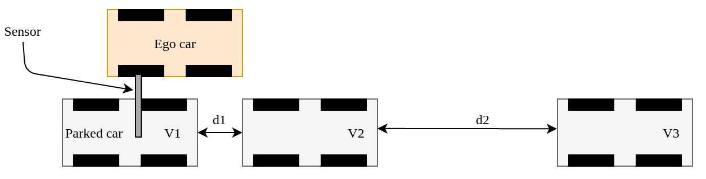
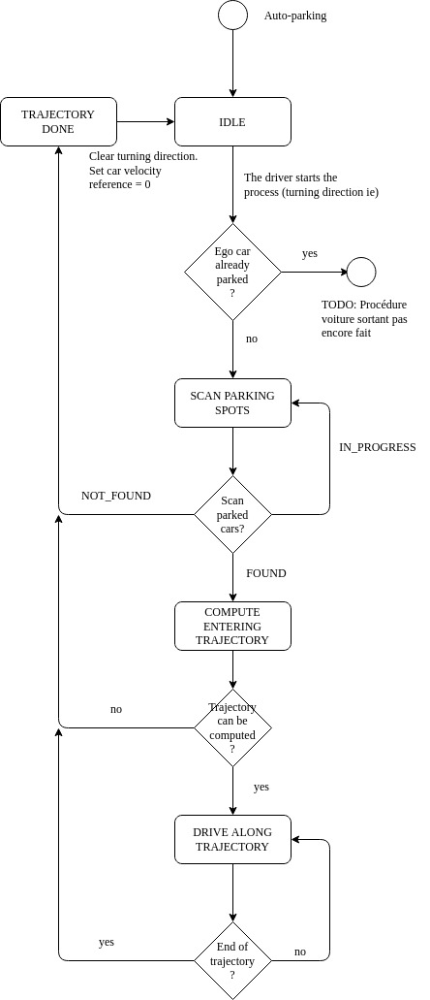
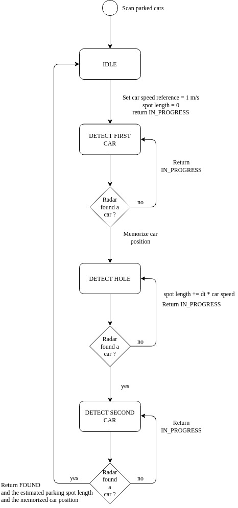
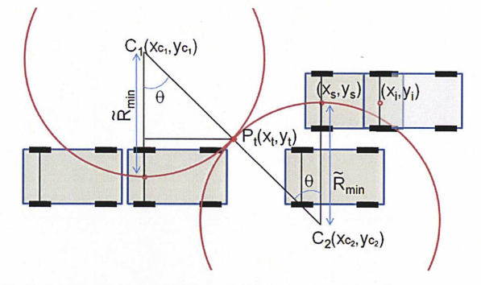
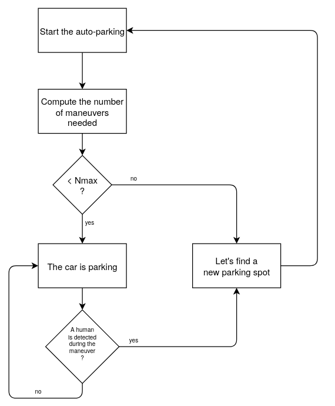

# Automatic Parallel Parking ECU

Parallel parking is the only implemented currently. Others (perpendicular, diagonal)
are present in the code but mathematics are not implemented.

Pics are refered in comments in the C++ code source. For emacs users, you can type
`M-x turn-on-iimage-mode` to show pictures linked in C++ comments. This will help you
to understand the code.

## Detail Designs

The Ego vehicle is driving along the road searching the first parking spot. It uses
a single "antenna" sensor.

The state machine for the parking is:

It calls the state machine for scanning empty parking spots:

The parallel trajectory is computed with documents refered in this bibliography.

Once the ego has found a trajectory to the empty spot:

## Bibliography

The code source refers to mathematic formulas from the following documents.
Note PDF have been compressed to reduce this repo size. You can google them
to get their original version without loose of quality.

-  `Estimation et contrôle pour le pilotage automatique de véhicule` by Sungwoo Choi
-  `Easy Path Planning and Robust Control for Automatic Parallel Parking` by Sungwoo CHOI, Clément Boussard, Brigitte d'Andréa-Novel.
Which is a summary of the previous document.
-  `Automatic Parking and Path Following Control for a Heavy-Duty Vehicle` by Joakim Mörhed and Filip Östman
-  `Automatic parking of self-driving car based on LIDAR` by Bijun Lee, Yang Wei, I. Yuan Guo.
- ( `Flatness and motion Planning the Car with n-trailer` by Pierre Rouchon.
