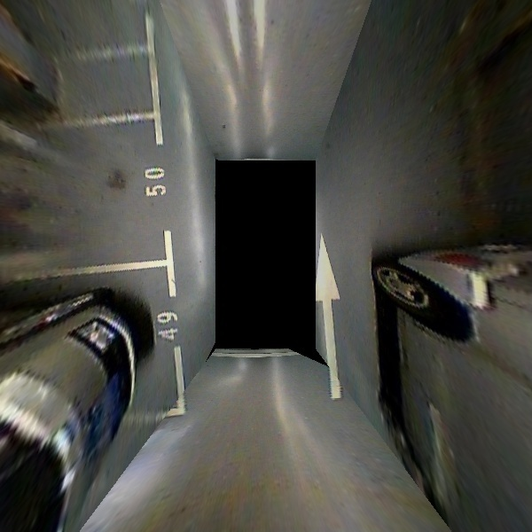
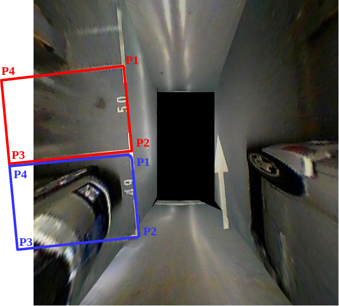
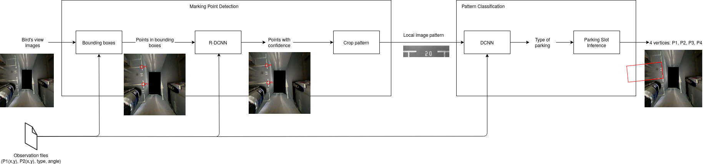

# Vision-Based Parking-Slot Detection: A DCNN-Based Approach and a Large-Scale Benchmark Dataset

DCNN: Deep convolutional network

The following code source has been adapted from the document and code that can be downloaded from
https://cslinzhang.github.io/deepps/ The original code is messy and we redone our own code.

## Steps

- Download ps2.0.zip and unzip it.
- `crop.py` will prepare dataset of pictures for the image pattern classifier.
- The marking-point detection based we YOLO has yet not been implemented. This DCNN will feed the parking slot classifier.
- `classifier.py` will classify parking spot.
- The computation of parking slot vertices is not made.

## Analyze

This page is an analyze and summary of the PDF document "Vision-based Parking-slot Detection: A DCNN-based Approach and A Large-scale Benchmark Dataset" by Lin Zhang, Junhao Huang, Xiyuan Li, and Lu Xiong

this paper can be downloadable at this link https://cslinzhang.github.io/deepps/ (as well as the database and the code source which is very messy. The entry point is DeepPSMatForPaper/processTestImgs.m).

### Goal

From the bird-eye's view obtained from 4 cameras placed on a vehicle and filming lanes of parking, and in where parking slots are partially filmed (due to the limited field of cameras, usually ~3 meters while a parking slot length is 5 meters), two DCNNs will detect parking slots, classify its type (parallel or perpendicular or diagonal form) and estimate the position of missing dimension of the slot. At the end we get the 4 vertices for each slots.

*Note:* this algorithm does not detect occupied slots but only complete its dimension!

### Inputs

From the 4 cameras on the vehicle, we have a single 360° bird-eye's view picture (aka surround view) like the following picture. The picture depicts parking slots in the form of L or T or V (parallel or perpendicular or diagonal form). The following kind of picture is the input of the algorithm.

A free database of bird's eye view for training the DCNN is given at https://drive.google.com/open?id=1i1pSnkIRyTgt6kmWr_sN6jrasX2HngWc

*Note:* the 4 raw pictures from cameras are not given in the database. Only the bird's eye view and the data needed for the training (vertices, segment lines, angle and type of parking) are given.



### Output

The algorithm described in the document will return the type of parking slot, and the 4 vertices. This allows, for example to draw, the estimate slot in the input image. For example:



*Note:* This picture does not come from the paper. I added rectangles myself by hand. Colors have no meaning here except to depict there is 2 parking slots.

### Algorithm

The code is given here https://drive.google.com/open?id=1qPx33fYNY8MhX7hv8lNAHAhlP14aNoDJ

The entry point of the project is DeepPSMatForPaper/processTestImgs.m

The algorithm's pipeline is the following:



#### Supervised data

- Observed data are stored in a matlab file (.mat) and have the same name that the input jpeg file. Their content is the follow:
  - A dictionary of vertices (named marks):
    - A marks is an array of two elements: 0: the X coordinates and 1: the Y coordinates.
  -  A dictionary of segment lines (named slots):
    - A slot is a structure made of :
      - two indices reference marks (starting from 1 because ... Matlab code)
      - the type of parking (1 .. 7):
        - parallel: clockwise or counterclockwise
        - perpendicular: clockwise or counterclockwise
        - diagonal form: clockwise or counterclockwise
        - invalid.
      - the angle of the parallel line of the parking (do not confuse with the angle of the camera): 90°, -90° ...
- Note 1: the mat file may hold unused marks. For example slot for pillars (like depict in the 1st picture of this current document) are invalid parking slots and their marks are given while their segments is not given (sad!).
- Note 2: containers may be empty. For example a picture with a single mark will have no valid segment lines and therefore the container for slots is empty. We have to deal this case for the label 'invalid'
- Note 3: I personally think they should have labeled this kind of slot as invalid and the parking angle is sufficient  to describe the type of parking.

Example of Python code to read these files:
```
import scipy.io

mat = scipy.io.loadmat('0001.mat')
mat
```

Will show for example:
```
{ ...,
  'marks': array([[204.70093114, 464.21673609], [192.17654987, 296.78326391], [177.98198971, 131.39634893], [170.97782406,  54.8974516]]),
  'slots': array([[ 1,  2,  1, 90], [ 2,  3,  1, 90]], dtype=uint8)
}
```

In this example, there is 4 marks but only two valid parking slot entries of type clockwise perpendicular.

#### Marking Point Detection

- A first deep region convolutional network (R-DCNN) for making a regression.
- The R-DCNN is the one given by Yolo R-DCNN (not described in the paper) but tuned for detecting parking vertices. The file is given at DeepPSMatForPaper/yolo-obj.cfg.
- Yolo is a general real-time object recognition algorithm that predict a class of an object and the bounding box specifying object location.
- For the parking vertices detection, it takes as input the bird's eye view and list of bounding box holding the interesting parking slots to detect. It return vertices of the entry slot with a confidence value.

#### Crop pattern

- Python code: crop.py
- From a pair of vertices (ie P1 and P2 in the picture of the previous figure) if their distance is sufficient to be considered as a parking entry then a bounding rectangle holding these is the image is then cropped.
- The algorithm is not well described but easy to make with OpenCV  and I gave in this file
  - P1 and P2 define a segment line.
  - We compute the 1st normal scaled N of this line: `N = (-dy, dx) * scale / length` where :
    - `dx = P2.x - P1.x`
    - `dy = P2.y - P2.y`
    - length = is the magnitude
    - and scale is a desired margin value.
  - We obtain new vertices of rectangle: [P1 - N, P1 + N, P2 + N, P2 - N]
  - From the segment line (P1, P1 + N) we compute the 2nd scaled normal M and we obtained the final bounding rectangle: [P1 - N + M, P1 + N + M, P2 + N - M, P2 - N - M]
  - This rectangle is oriented. We can compute the transformation matrix thanks to OpenCV functions:
    - getPerspectiveTransform() and warpPerspective() functions.
    - where the source points are our rectangle and the destination points is the new image size (h, w) = (48, 192) for example.

#### Pattern classification

From the cropped picture, we want to determine the type of parking slot:
- parallel: clockwise or counterclockwise (ie pics (b), (e))
- perpendicular: clockwise or counterclockwise (ie pics (b), (e))
- diagonal form: clockwise or counterclockwise (ie pics (c), (d), (f), (g))
- invalid (h).


The Pattern classification is a second deep convolutional network to make supervised classification and its pipeline is described by the following figure. At the end of the document I give a try to implement this network with Keras (a wrapper on TensorFlow since the API is simple).

- It takes as input the cropped image and return a label along the 7 parking types:
  - parallel: clockwise or counterclockwise
  - perpendicular: clockwise or counterclockwise
  - diagonal form: clockwise or counterclockwise
  - invalid.
- It is made in Cafee and given in DeepPSMatForPaper/deploy.prototxt and called by DeepPSMatForPaper/parkingslot_detector.m


#### Parking Slot inference

- From the parking type, its angle (ie 45°, -90° ...), its length and the two vertices (P1 and P2) we can obtain the 4 vertices (P3, P4).
- We simply use a the rotation matrix 2x2 (cos sin; -sin cos) times the parking normalized width times the parking length.
- With these 4 vertices we can for example draw the rectangle in the image.

```
angle = radians(90°)

R = [cos(angle) sin(angle); -sin(angle) cos(angle)]
width = P1P2 / norm(P1P2)

P3 = R * width * length + P2
P4 = R * width * length + P1
```

## My personal and quick implementation of the DCNN#2 for the parking classification

Disclaimer: this is my first deep learning code. This a noob code and for the moment I did not add time to add all plots (history, loss, accuracy, confusion matrix, negative results ...) so do not trust this code!

Since parking slot of type 1 (perpendicular) is majority compared to type 2 and type 3 (diagonal) instead of creating new pictures, I simply reduced the number of pictures for type 1.

In this git repo I added my home made dataset (800 Ko) and the Python3 code of the DCNN for the classification. A csv file is generated with expected and estimated labels (1 or 2 or 3)

Notes:
- Adapt my paths to your system.
- If needed, remove comments to run the code # crop_all (to be done once) to generate input pictures from the official datasets of the original authors (DeepPS.zip ~2.4 Go).
- The training is very fast (less than 1 minute)

## My Personal comments on the paper

- The database of parking slots is reduced ~30000 pictures and this cannot be used for production.
- Some parking slots is more present than other (ie perpendicular vs. diagonals). So we have to complete the training by "creating" (to be defined) missing pictures or complete with real pictures. In my case, because I wanted to test quickly the algorithm, I reduced the quantity of pics on over represented parking slots to have similar quantities for kind of parkings.
- The second DCNN (parking classification) uses plenty of hyper-parameters. Are they really useful ? In my quick implementation I did not add them. I really think this kind of classification should be similar to MNIST but instead of recognizing 10 handwritten digits we have to recognize 3 characters (T, L and V) which are the shape of parking slots.
- They are using two DCNNs, would one have been probably sufficient ? Since the 1st DCNN find marks why not simply have expended it to estimate the 4 vertices and the angle (for example having add 4 vertices in the mat files) ?
  - I'm a beginner in DCNN but I think its not possible to mix a regression and classification inside a single network. A classification is a regression in where the last layer is ended by a softmax function to return a probability on the label (parking type) and while from the angle, we can determine the parking type, I think its easier to manipulate information such as "this parking has 90% of chance to be a parallel slot" rather than this "parking angle is 89°".
  - For the idea of 4 corners, somebody made another database: https://github.com/marquistj13/label_tj_parkingslot_2_0 but I did not dive inside.
- Even in this paper, the most difficult part is to find parking slot corners. Finding the type of parking is then easy.
