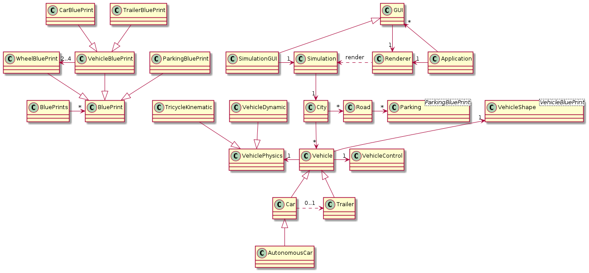

# Folder hierarchy

- Application: Wraps SFML to make windows and menu.
- Common: Helper routines for general purpose.
- Math: General mathematic routines.
- Renderer: Draw stuff with SFML.
- Prolog: Wraps Prolog utilities.
- Sensors: Vehicle sensors.
- Vehicle: vehicle shape and physics.
- ECUs: Electronic Control Unit: read sensors and/or do actions on the vehicle.
- City: Simulate a city.
- Simulation: core for the simulation.

## Classes diagram

